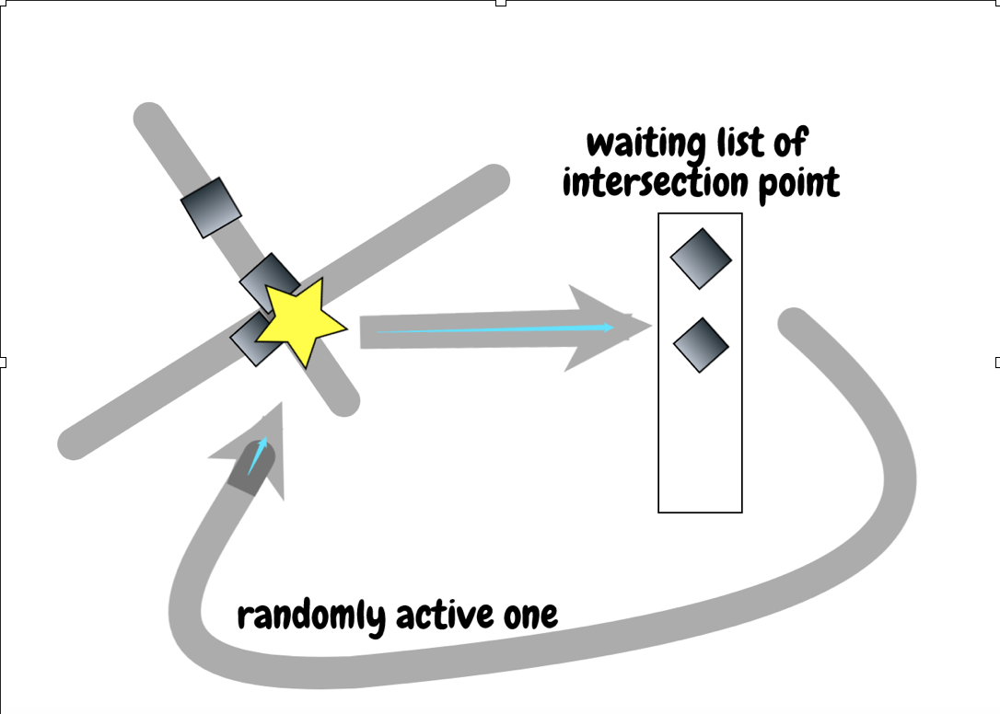
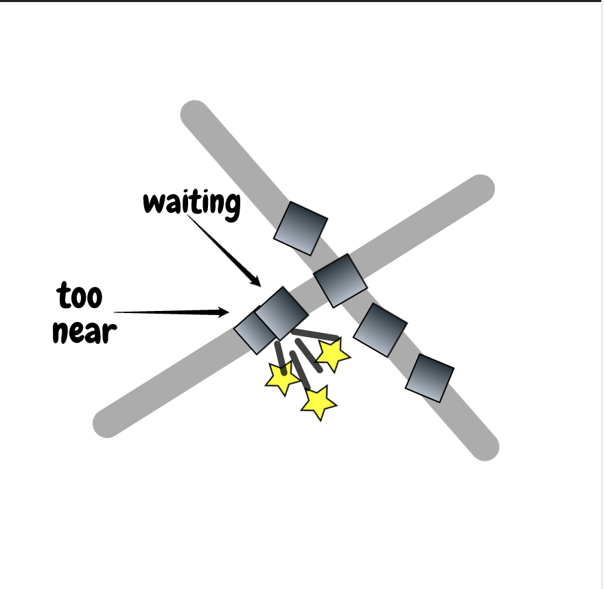
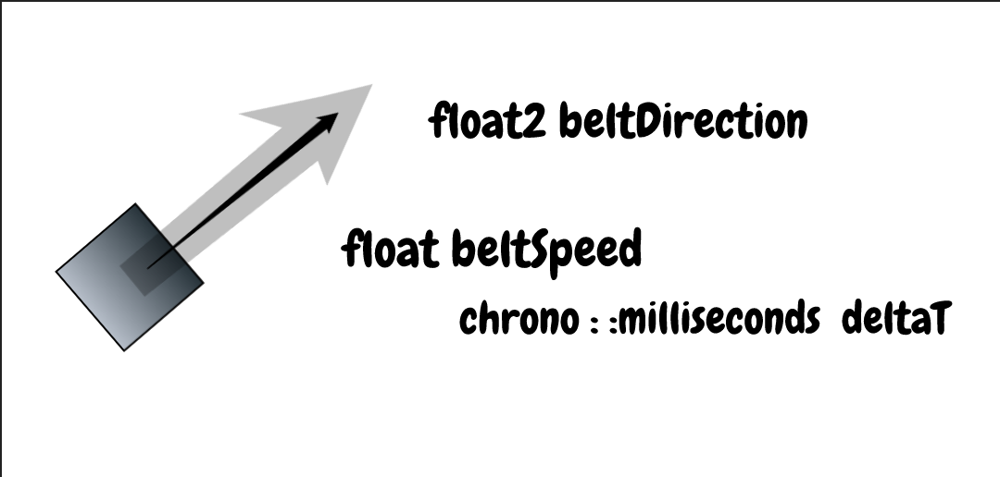
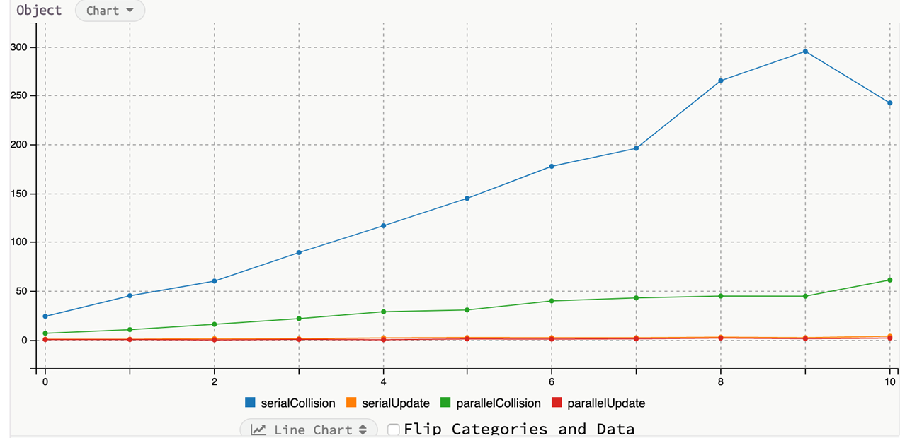
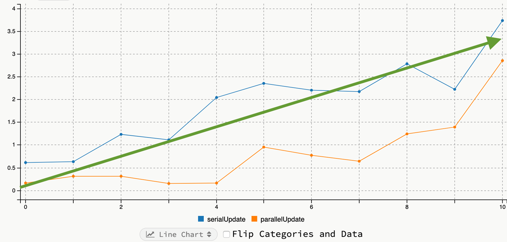

# Fast-Belt

Lin dongwu & Liu wenji

## Introduction

Procedural content generation game will initialize hundreds of thousands of entities in the scene. Different to web applications, where only a small subset of entities will be update each frame, in the game, all of hundreds of thousands of entities need to be update in every 16ms.

So there is a strong need in game system to parallelize object update. But it is not straightforward to do it, since entities may interact with each other, thus requires some preprocessing of object states.

In this project we build a simple world with 500000 box entities and 10 crossing belts, where boxes moves on the belt, and will stop moving to prevent collision if there is a "traffic jam" in front of it. We make position update and collision resolving logic parallel.

## Box Behavior

Belts (传送带) move boxes on them, boxes may collide with each other if belts are crossing.

Upon colliding, smart boxes may wait a second to prevent collision. Lots of objects to update in each frame of game loop.

### steps in a game frame

Foreach box, detect whether they may collapse with boxes on the other belt (near the intersection point of belt), if so, add a flag #nearIntersection to it.

This is done in parallel, then foreach intersection, choose one belt to active (diagram 1):



Foreach box check if it is too close to the box in front of it.
When "the box in front of it" is waiting for traffic light, This is done in parallel, So items on the belt won’t stop all together immediately, instead works like a traffic jam (stop one box in each frame), see (diagram 2):



Update boxes’ position based on context state and delta time in game loop, This is also done in parallel (diagram 3):



## The MPI Approach

First we try to use MPI, which provides an easy to use IPC primitives, and `boost::mpi` makes it even easier to use.

But we finally found that MPI is not designed for PC game programming, MPI was only designed for HPC, calculate things on a computer grid, it is not designed to be used in a single computer.

For game parallelism, the proper way is to use p_thread to parallel systems, or use openmp to parallel for loop inside system.

And for the best cross platform solution, we should use parallel stl to parallel for loop inside system, and use `std::async` to parallel systems after building a task dependency tree. Parallel stl and `std::async` can work together to get the best possible result.

## Parallel algorithms

We finally decided using openmp to parallel for loop inside collision resolution system and position update system.

### data structure

There exists three types of objects in our problem, i.e. box(object),belt and intersection points.

Respectively, we define following data structures for them.

```c++
struct belt {
  float2 start; // start of the belt
  float2 end;  // end of the belt
  float speed; // moving speed of the belt
};
struct object_data {
  float2 pos;  // position of the data
  float2 direction; // object moving direction
  bool state_byLock=true;// true means the object is active and moving
  bool state=true;
  int intersectId;// moving across which intersection point
};
struct intersect {
  float2 pos;  // position of the intersection point
  int intersectId; // the id of the object which is set active to move, while the others objects near the intersect is set stopped
};
```

Notice that the object has two bool variables, `state_byLock` denotes the state (active/stopped) determined by the intersection point while `state` denotes the final state.

The main consideration is the state should be rechecked to avoid possible collision and for parallelism.

An object may be set to be active but its pre-object is stopped and the object is too close to pre-object. then this object should also be set to stopped instead of active.

### Main Algorithm

We have four steps:

1. check if any object near the possible intersection point
2. for each intersection, only allow one object to move and others to be stopped
3. recheck objects' state

4. if pre object is active , then do nothing( since it can be stopped by the intersection point )

5. if pre object is stopped and the distance to it is close ,then set to stopped
6. update only active objects' position

To highly parallelize , we do mainly following tricks :

#### for step 1 and 2 , we let each object freely writes its id to possible intersect's intersectId variable, then take another parallelism to check whether its writing is successful.

  ```c++
  inline void check_obj_intersect(object_data * objects, unsigned int objectNum, std::vector<intersect>& intersects) {
  #pragma omp parallel for num_threads(8)
    for (int i = 0; i < objectNum; i++) {
      objects[i].state_byLock = true;
      for (unsigned int j = 0; j < intersects.size(); j++) {
        objects[i].intersectId = -1;
        if (dist(objects[i].pos, intersects[j].pos) < affectDist) {
          objects[i].intersectId = j;
          intersects[j].intersectId = i;
          break;
        }
      }
    }
  #pragma omp parallel for num_threads(8)
    for (int i = 0; i < objectNum; i++) {
      if (objects[i].intersectId != -1 ) {
        if (intersects[objects[i].intersectId].intersectId == i) {
          objects[i].state_byLock = true;
        }
        else {
          objects[i].state_byLock = false;
        }
      }
    }
  }
  ```

#### for step 3 and 4 , we can highly parallelize since we can check pre-object's state through `state_byLock`

  ```c++
  inline void update_object_state(object_data * objects, unsigned int objNumPerBelt, unsigned int beltNum) {
  #pragma omp parallel for num_threads(8)
    for (int i = 0; i < objNumPerBelt*beltNum; i++) {
      if (i%objNumPerBelt != 0&&i!=0&&i!= objNumPerBelt*beltNum-1) {//no process belt head if from another array
        if (objects[i + 1].state_byLock == true) {
        }
        else if (dist(objects[i + 1].pos, objects[i].pos) < affectDist) {
          objects[i].state = false;
        }
      }
      else {
        objects[i].state = objects[i].state_byLock;
      }
      if (objects[i].state == true) {
        objects[i].pos.x += objects[i].direction.x*beltSpeed;
        objects[i].pos.y += objects[i].direction.y*beltSpeed;
      }
    }
  }
  ```

## Results

We test our program using 10 belts, and increase the number of the objects on each belt.



parallel reduce to upto $\frac{1}{7}$ the collision detection cost (blue to green) $\frac{O(n^2)}{7}$



Result:

Also half the object update cost $\frac{O(n)}{2}$

## References

Discussion with entt developers https://gitter.im/skypjack/entt?at=5cf4ba8fe41fe15e7502e540
